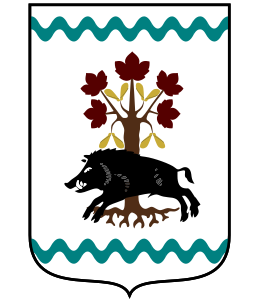

# Albero di Famiglia Barisonzi (1781-2023)

## Prima Generazione

La famiglia di Mauro Antonio Barisonzi (????-????)

e Costanza Milanesi (????-????)

Matrimonio: circa 1780?

Figli:

1. Rosa Maria Barisonzi, [battezzata nel 1781](./battesimo/cava_manara/rosa_maria_barisonzi_1781.jpg) a [Cava Manara](luoghi/cava_manara.md)
2. Giuseppe Antonio Barisonzi, [battezzato nel 1783](./battesimo/cava_manara/giuseppe_antonio_barisonzi_1783.jpg) a [Cava Manara](luoghi/cava_manara.md)
3. Carlo Antonio Barisonzi, [battezzato il 18 febbraio 1785](./battesimo/cava_manara/carlo_antonio_barisonzi_1785.jpg) a [Cava Manara](luoghi/cava_manara.md)
4. Maria Teresa Barisonzi, [battezzata l'11 aprile 1788](./battesimo/cava_manara/maria_teresa_barisonzi_1788.jpg) a [Cava Manara](luoghi/cava_manara.md)
5. Pietro Antonio Barisonzi, [battezzato il 9 novembre 1791](./battesimo/cava_manara/pietro_antonio_barisonzi_1791.jpg) a [Cava Manara](luoghi/cava_manara.md)
6. Luigi Antonio Barisonzi, [battezzato il 7 aprile 1794](./battesimo/cava_manara/luigi_antonio_barisonzi_1794.jpg) a [Cava Manara](luoghi/cava_manara.md)
7. Antonio Domenico Barisonzi, [battezzato l'8 marzo 1797](./battesimo/cava_manara/antonio_domenico_barisonzi_1797.jpg) a [Cava Manara](luoghi/cava_manara.md)

## Seconda Generazione

La famiglia di Giuseppe Antonio Barisonzi (1783-????)

e Maria Giuseppa Maggi (????-????), figlia di Stefano e di Maria Antonia

Matrimonio: [13 febbraio 1806](./atti_matrimonio/cava_manara/giuseppe_antonio_barisonzi_maria_giuseppa_maggi_1806.jpg), [parrocchia di S. Agostino](luoghi/parrocchia_s_agostino.md), [Cava Manara](luoghi/cava_manara.md)

Figli:

- Maria Teresa Barisonzi, nata a [San Martino Siccomario](luoghi/san_martino_siccomario.md)
- Luigi ????

## Terza Generazione

La famiglia di Luigi Barisonzi (????-????)
professione: famiglio

e Francesca Piccaluga (????-????)
professione: contadina

Matrimonio: circa 1831?

Figli:

1. Maria Giovanna Lucia Barisonzi, [nata il 29 luglio 1832](./battesimo/san_martino_siccomario/maria_giovanna_lucia_barisonzi_1832.jpg) e morta il 30 luglio 1832 a [San Martino Siccomario](luoghi/san_martino_siccomario.md)
2. (senza nome), [nata morta il 29 luglio 1832](./battesimo/san_martino_siccomario/maria_giovanna_lucia_barisonzi_1832.jpg) a [San Martino Siccomario](luoghi/san_martino_siccomario.md)
3. (senza nome), [nata morta il 29 luglio 1832](./battesimo/san_martino_siccomario/maria_giovanna_lucia_barisonzi_1832.jpg) a [San Martino Siccomario](luoghi/san_martino_siccomario.md)
4. Maria Giuseppa Barisonzi, [nata il 3 gennaio 1834](./battesimo/san_martino_siccomario/maria_giuseppa_barisonzi_1834.jpg) a [San Martino Siccomario](luoghi/san_martino_siccomario.md)
5. Giuseppe Antonio Barisonzi, [nato il 1 febbraio 1836](./battesimo/san_martino_siccomario/giuseppe_antonio_barisonzi_1836.jpg) e morto il 13 febbraio 1836 a [San Martino Siccomario](luoghi/san_martino_siccomario.md)
6. Giuseppe Antonio Barisonzi, [nato il 30 settembre 1838](./battesimo/san_martino_siccomario/giuseppe_antonio_barisonzi_1838.jpg) a [San Martino Siccomario](luoghi/san_martino_siccomario.md)
7. Maria Luigia Enrica Barisonzi, [nata il 9 settembre 1841](.battesimo/san_martino_siccomario/maria_luigia_enrica_barisonzi_1841.jpg) a [San Martino Siccomario](luoghi/san_martino_siccomario.md)
8. Pietro Giovanni Barisonzi, [nato il 12 novembre 1854](./battesimo/san_martino_siccomario/barisonzi_pietro_giovanni_1854.jpg) a [San Martino Siccomario](luoghi/san_martino_siccomario.md) e [morto nel 1937](.camposanto/cava_manara/IMG_20220610_152521523.jpg) a [Cava Manara](luoghi/cava_manara.md)

## Quarta Generazione

La famiglia di Pietro Giovanni Barisonzi (1854-1937)
professione: contadino

e Maria Giuseppa Rovati (1856-1946), figlia di Giuseppe e Maria Rognoni
professione: contadina

Matrimonio: [12 gennaio 1879](./atti_matrimonio/san_martino_siccomario/barisonzi_pietro_giovanni_rovati_maria_giuseppa_1879.jpg) a [San Martino Siccomario](luoghi/san_martino_siccomario.md)

Figli:

- Giuseppe Barisonzi
- Giovanni Barisonzi, nato il 26 settembre 1881 a [San Martino Siccomario](luoghi/san_martino_siccomario.md) e morto a Pavia nel 1949
- Mario Barisonzi, nato il 30 giugno 1896
- Enrica Barisonzi
- Giulia Barisonzi
